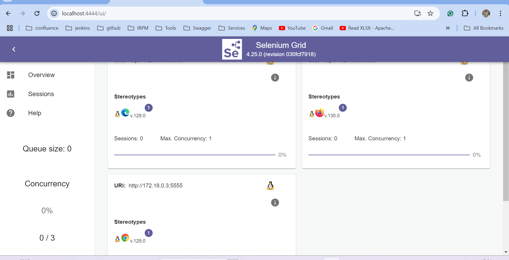
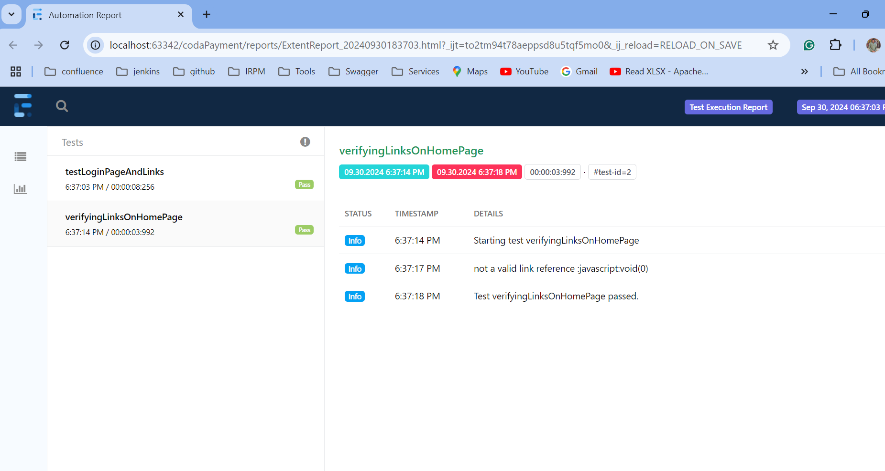
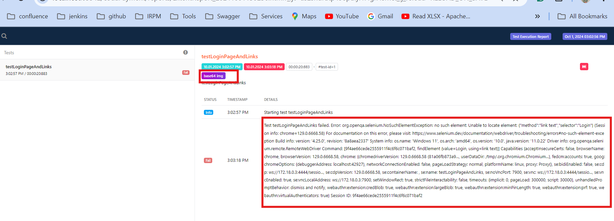
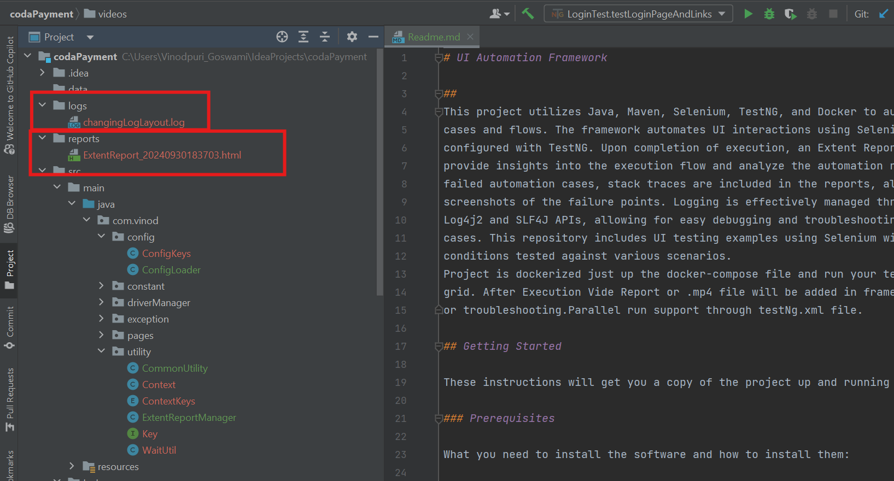

# UI Automation Framework

##
This project leverages **Java, Maven, Selenium, TestNG, and Docker** to automate UI test cases and workflows. The framework enables seamless automation of UI interactions via Selenium, while TestNG is used for test configuration and execution management.

Upon completion of test execution, a comprehensive **Extent Report** is generated, providing detailed insights into the execution flow, along with results analysis. For failed test cases, the report includes **stack traces** and **screenshots** of failure points to facilitate efficient debugging.

Logging is robustly managed using **Log4j2/Log-back and SLF4J APIs**, enabling efficient tracking of test execution and troubleshooting historical automation runs. Additionally, the project includes UI testing examples with Selenium that assert conditions across a variety of test scenarios.

The framework is **dockerized**, making it easy to run tests in a **Selenium Docker Grid environment**. By simply running the docker-compose file, tests can be executed within containers, ensuring consistency across different environments. After execution, **video reports (.mp4)** are automatically generated for failed tests, allowing for detailed debugging and analysis.

The project also supports **parallel execution via the testng.xml** configuration, optimizing test run times and improving overall efficiency in large-scale testing scenarios.

The framework provides **custom runtime parameters and environment-specific configurations**, allowing users to easily override default settings at runtime. This flexibility ensures seamless test execution across different environments, making it adaptable for development, staging, or production scenarios.

## Getting Started

These instructions will get you a copy of the project up and running on your local machine for development and testing purposes.

### Prerequisites

What you need to install the software and how to install them:

1. **Java JDK 11+**
    - [Download Java](https://www.oracle.com/java/technologies/javase-jdk11-downloads.html)
    - Ensure Java JDK is set up properly with the `JAVA_HOME` environment variable.

2. **Maven**
    - [Download Maven](https://maven.apache.org/download.cgi)
    - Follow installation instructions here: [Maven installation guide](https://maven.apache.org/install.html)

3. **Docker** - (Not Mandatory)
    - [Download Docker](https://docs.docker.com/get-started/get-docker/)
    - Follow installation instructions here: [Docker installation guide](https://docs.docker.com/engine/install/)

**Some usefully Docker Command**

1. To Run Docker Image/Container With Runtime Configuration
   ```bash
   docker run test-runner -DisRemote=false -Denv=dev
   ```

2. To Run specific image-name with Runtime Configuration in docker-compose 
   ```bash
   docker-compose run --rm test-runner -DisRemote=false -Denv=dev
   ```
**Note:** test-runner is image-name


### Steps to set up and run the project:

1. **Clone the Repository:**
   ```bash
    git clone https://github.com/VINOD-GOSWAMI/TestNg_Selenium_Docker.git
   ```
2. **Navigate to the project directory:**
   ```bash
    cd TestNg_Selenium_Docker
   ```
     
3. **Different Ways to Run Automation Test Cases:**
   1. **To Run All tests inside Docker Container with Runtime Configuration:**
      ```bash
      docker-compose run --rm test-runner -DisRemote=true -Denv=dev
      ```    
      Note:- Reports and Logs can be view from docker-report ,docker-logs,videos folder
   
   2. **To Run Test on Dockerized Selenium Grid:**
      1. **Setup Dockerized Selenium Grid via docker-compose:**
         ```bash
         docker compose -f docker-compose-selenium-grid.yml up
         ```
      2. **Run the tests using Maven with Runtime Configuration:**
         ```bash
         mvn test -Denv=dev -DisRemote=true 
         ```
   3. **To Run Test Locally using Maven with Runtime Configuration:**
      ```bash
      mvn test -Denv=dev -DisRemote=false -DheadLess=true
      ```
      Note:- 
      1. Reports and Logs can be view from reports ,logs,videos folder
      2. When Running Test using Docker for i & ii way Check Grid Registration
         on http://localhost:4444
         
      3. After Running Test Close the Containers 

4. **After Running Test To View Execution Report:**
    
    

5. **To View Logs:**
   


## Feature of Framework
The following features have been implemented as part of this framework:

1. **Production-Ready Automation:** Utilizes Selenium, TestNG, Maven, and Docker for seamless UI test automation.

2. **Logging Integration:** Implements SLF4J interface for logging. You can easily integrate with Log4j2/Log-back or Logback by adding the appropriate adapter.

3. **Extent Report Integration:** Automatically generates an Extent Report after each test run, logging critical steps and flows. This report includes historical data, stack traces for failures, and screenshots of failure points.

4. **Parallel Execution Support:** Leverages TestNG’s capabilities for parallel execution, ensuring no conflicts in reporting.

5. **Custom Configuration Loader:** Manages environment properties effectively with a default property file. Overrides can be set through environment variables or system properties for maximum flexibility.

6. **Integration with Surefire Plugin:** Enables efficient test execution and reporting.

7. **Dockerized Project:** Simply run docker-compose up to execute your test cases within a Docker container.


Folder Structure
```tree
├───data
├───logs       --logs will be stored inside this
├───reports    -- after execution extent report will generated here 
├───src
│   ├───main
│   │   ├───java
│   │   │   └───com
│   │   │       └───vinod
│   │   │           ├───config         -- ConfigLoader Runtime and Env Config Handling
│   │   │           ├───constant       -- Constant Classes Require for Application
│   │   │           ├───driverManager  -- driver Managing Code From Intialized to Managing to getting driver instance
│   │   │           ├───exception      -- exception classes to handle Custom exception
│   │   │           ├───pages          -- page object model implementation
│   │   │           └───utility        -- Utility Classes that required for the project
│   │   └───resources                  -- all config files application.properites, application-dev.properites, Log4j2.properties,logack.xml
│   └───test
│       └───java
│           └───com
│               └───vinod
│                   ├───listners       -- Testng Listners Implemented For Reporting
│                   └───test           -- Test Classses
├───testNg.xml                         -- TestNg Suite For Running Test Cases
│
├───docker-compose.yml                 --  Dockerized Selenium Grid to Setup and Run Across Browser/Platform
│
├─── Dockerfile                        -- Dockerized Current Framework
│
│
│
└───videos                             -- video report of execution
    ├───chrome
    ├───edge
    └───firefox
```


   


